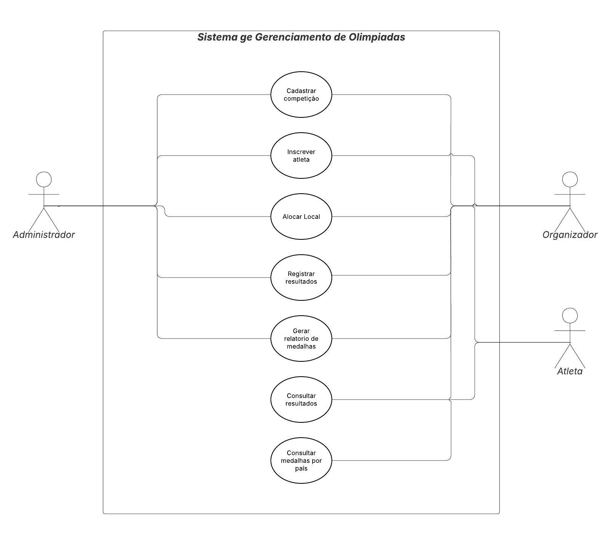
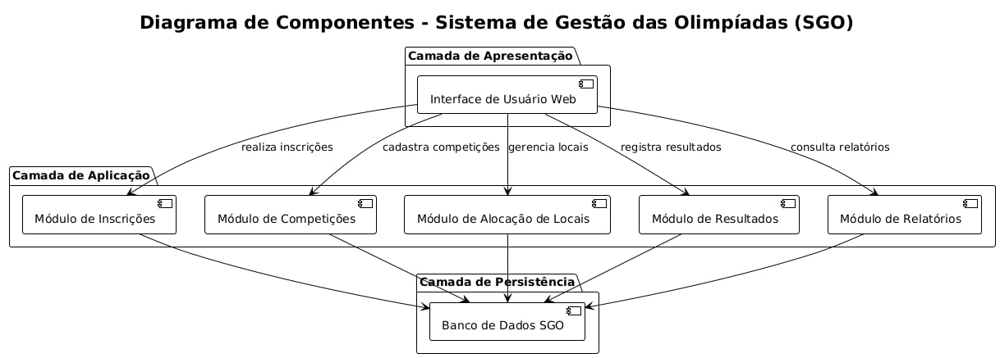
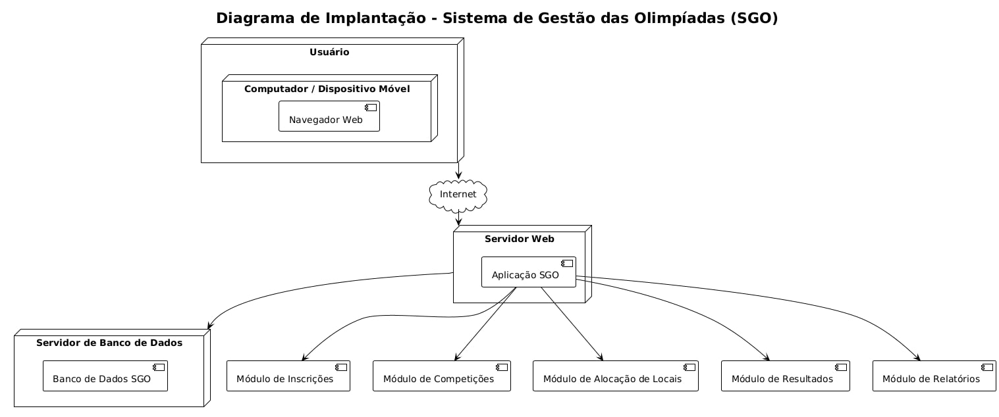

# 🏅 Sistema de Gestão das Olimpíadas (SGO)

> Projeto desenvolvido como parte da disciplina **Projeto de Software** (4º período de Engenharia de Software) – Professor João Paulo Carneiro Aramuni.

O **Sistema de Gestão das Olimpíadas (SGO)** foi idealizado para centralizar e automatizar a administração das competições olímpicas, permitindo o **gerenciamento de modalidades**, **inscrição de atletas**, **alocação de locais**, **registro de resultados** e **emissão de relatórios de desempenho e medalhas**.

---

## 🎯 Objetivos do Sistema

- Garantir a **organização eficiente das competições olímpicas**;
- Automatizar o **controle de inscrições e resultados**;
- Evitar **conflitos de locais e horários** entre competições;
- Fornecer **relatórios precisos e em tempo real** de medalhas e desempenho;
- Facilitar o **trabalho do comitê organizador e das federações esportivas**.

---

## 📋 Funcionalidades Principais

- **Cadastro de Competições** – Inclusão de modalidades, locais, horários e atletas participantes;  
- **Gestão de Atletas e Países** – Controle de informações e inscrições de cada atleta;  
- **Alocação de Locais** – Definição e agendamento de locais sem sobreposição de horários;  
- **Registro de Resultados** – Inserção dos vencedores e classificação automática;  
- **Relatórios de Medalhas** – Geração e exportação de relatórios por país e modalidade.  

---

## 👥 Atores do Sistema

---

## 🧩 Estrutura do Repositório

📁 Sistema-de-Gestao-Olimpiadas/
┣ 📁 diagramas/
┃ ┣ Diagrama-de-Casos-de-Uso.jpg
┃ ┣ Diagrama-de-Componentes.jpg
┃ ┗ Diagrama-de-Implantacao.jpg
┗ 📄 README.md

---

## 👤 Histórias de Usuário

| ID | História de Usuário | Prioridade |
|----|----------------------|-------------|
| **US01** | Como **organizador**, desejo cadastrar novas competições informando modalidade, data e local, para planejar o cronograma de provas. | Alta |
| **US02** | Como **atleta**, quero me inscrever em diferentes modalidades, para participar oficialmente das Olimpíadas. | Alta |
| **US03** | Como **gestor de locais**, desejo verificar e alocar arenas sem conflitos de horário, para evitar sobreposição de eventos. | Alta |
| **US04** | Como **árbitro**, quero registrar os resultados das competições, para atualizar automaticamente o quadro de medalhas. | Alta |
| **US05** | Como **coordenador**, desejo visualizar relatórios de desempenho por país, para acompanhar a evolução dos resultados. | Média |
| **US06** | Como **administrador do sistema**, quero gerenciar usuários e permissões, garantindo segurança e integridade dos dados. | Média |
| **US07** | Como **analista do comitê**, desejo exportar relatórios em PDF ou CSV, para fins de auditoria e divulgação oficial. | Baixa |

---

## 🧠 Regras de Negócio

1. **Cadastro de Competições:** Cada competição deve conter nome, modalidade, local, data e horário únicos.  
2. **Inscrição de Atletas:** Um atleta pode se inscrever em várias competições, mas apenas por **um país** em cada modalidade.  
3. **Validação de Conflitos:** O sistema impede o agendamento de duas competições no mesmo local e horário.  
4. **Registro de Resultados:** Cada competição deve registrar **1º, 2º e 3º lugares**, atualizando o quadro de medalhas automaticamente.  
5. **Relatórios de Medalhas:** O sistema calcula o ranking geral com base em **medalhas de ouro, prata e bronze**.  
6. **Controle de Usuários:** O administrador define perfis e permissões (organizador, árbitro, atleta).  
7. **Persistência de Dados:** Todas as alterações (inscrições, resultados, locais) são registradas com data e hora para auditoria.  
8. **Exportação de Relatórios:** Os relatórios podem ser exportados em formatos **PDF** e **CSV**, filtrados por país, modalidade ou período.

---

## 🏗️ Diagramas do Sistema

### 1. Diagrama de Caso de Uso

### 4. Diagrama de Componentes

### 5. Diagrama de Implantação

---

## 🛠️ Tecnologias Recomendadas

- **Backend:** Java Spring Boot ou Node.js  
- **Frontend:** React, Vue.js ou Angular  
- **Banco de Dados:** PostgreSQL ou MySQL  
- **Infraestrutura:** Docker, AWS ou Azure  
- **Documentação:** Swagger / OpenAPI  

---

## 🧾 Regras de Negócio Implementadas

✅ **Cadastro de Competições** – Criação e gerenciamento com horário e local validados;  
✅ **Inscrição de Atletas** – Controle por país e modalidade;  
✅ **Alocação de Locais** – Detecção automática de conflitos;  
✅ **Controle de Resultados** – Atualização imediata do ranking;  
✅ **Relatórios de Medalhas** – Cálculo e exibição dinâmica por país;  
✅ **Gerenciamento de Usuários** – Perfis com níveis de acesso distintos.  

---

## 💡 Diferenciais do Projeto

✅ **Cobertura completa dos 5 diagramas UML obrigatórios** (caso de uso, classes, pacotes, componentes e implantação);  
✅ **Organização modular** entre camadas (apresentação, aplicação, domínio e dados);  
✅ **Arquitetura em 3 camadas** com foco em escalabilidade;  
✅ **Relatórios configuráveis e exportáveis**;  
✅ **Camada de segurança e autenticação integrada**;  
✅ **Design profissional do README**, com import direto das imagens do repositório.  

---

## 👨‍💻 Autores

**👩‍💻 Guilherme de Almeida Santos**  
**👨‍💻 Pedro Rodrigues Duarte**  
Estudantes de Engenharia de Software – 4º Período  
📍 Desenvolvido para a disciplina de **Projeto de Software** – PUC Minas  
